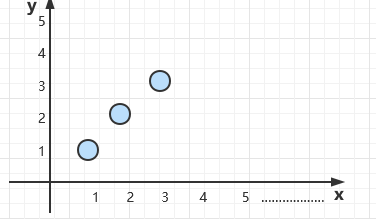

# 线性回归

## 1.例子

**举个例子**：

给定这样的X、Y值：(1,1)、(2,2)、(3,3)、(4,4)、(10,10)，问当X=5时，Y等于多少？显然Y=5；建立了X与Y的关系：$Y=X$

再看一个难一点的例子：给定这样的X、Y值：(1,1)、(2,4)s、(4,16）、(100,10000)，问当X=5时，Y等于多少？显然Y=25，同样建立了X与Y之间的关系$$Y=X^2$$​

**再举个例子**：

- 期末考试成绩=0.7 * 考试成绩+0.3 * 平时成绩   -----------   建立这样的一个关系：$Y=0.7*x_1+0.3*x_2$​（$x_1$代表考试成绩、$x_2$代表平时成绩、Y表示期末成绩）​
- 房子价格=0.02 * 中心区域的距离 + 0.04 * 城市一氧化氮浓度 +0.2 * 城镇犯罪率---------建立关系：$Y=0.02*x_1+0.04*x_2+0.2*x_3$（其中Y为房价、$x_1$为中心区域距离、$x_2$为城市一氧化氮浓度、$x_3$为城市犯罪率）

线性回归就是采用这样的工作原理。计算机会通过"理解"给定的数据，尝试确定X和Y之间”最合适“的关系。使用建立好的关系就可以预测给定的X值并预测未知的Y值（X记为特征值、Y记为目标值，建立特征值与目标值之间的关系---->回归方程）

## 2.定义、公式与符号表示

## 3.求解公式与推导过程

## 4.特征归一化

## 5.欠拟合与过拟合

## 6.Ridage回归

## 7.LASSO回归

## 8.房价预测案例

给定这样的x,y值：

（1,1）、（2,2）、（3,3）、（4、？） 此时当x=4时，y=4 得出一个函数：$Y=X$

（1,1）、（2，4）、（3，9）、（4，？）此时当x=4，y=16 得出一个函数：$Y=X^2$

期末成绩 = 0.6x期末成绩+0.4x期中成绩

房价=0.05x距离中心区域的距离+0.03x城镇犯罪率+0.02x城市绿化率+/- 0.01x平均房价

我们来理解一下上面的例子，首先通过给定的数据，建立X与Y之间

