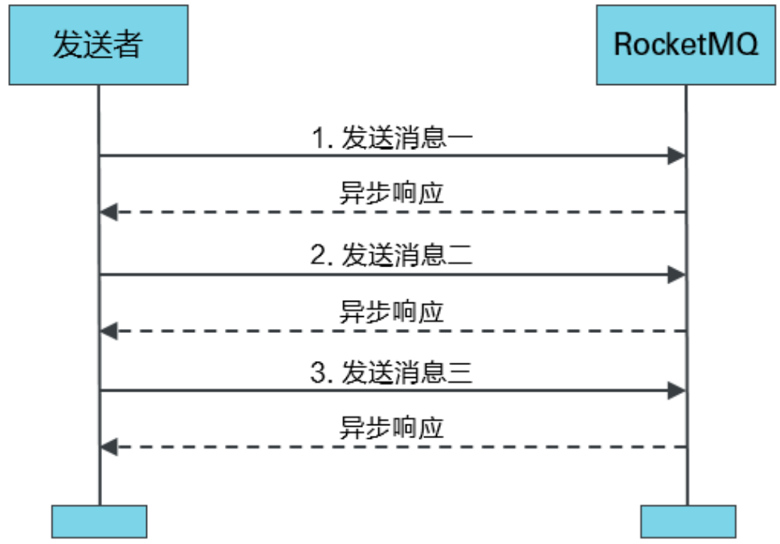
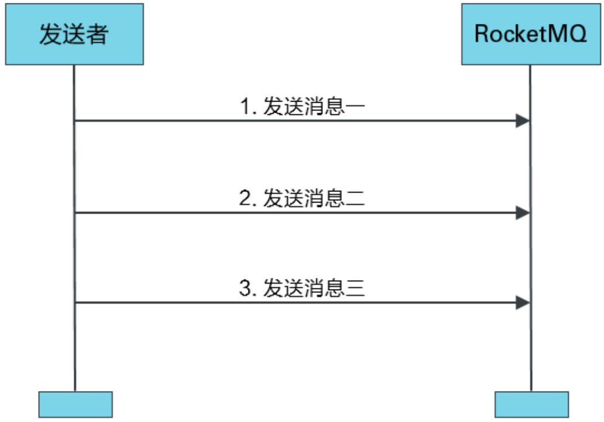
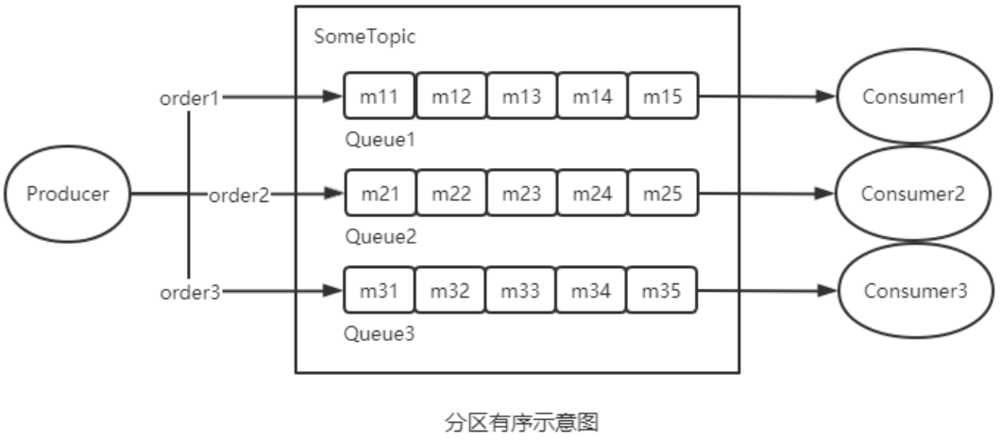
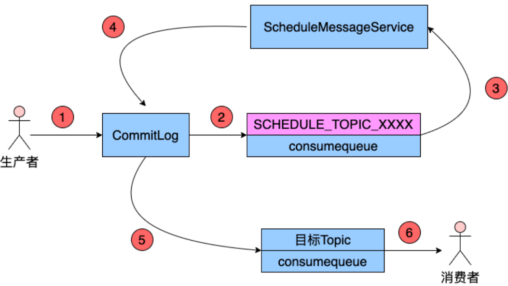
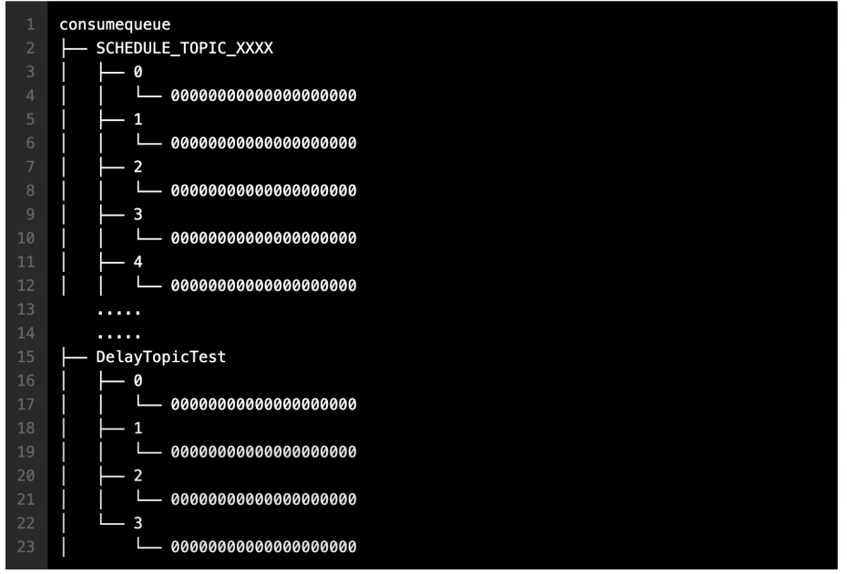
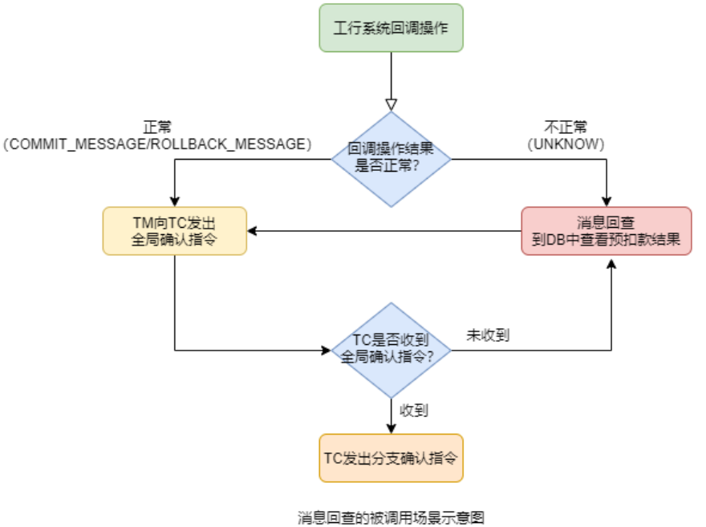
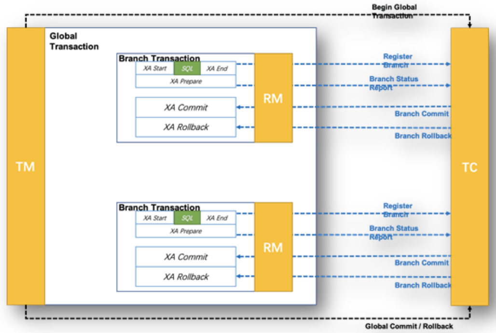
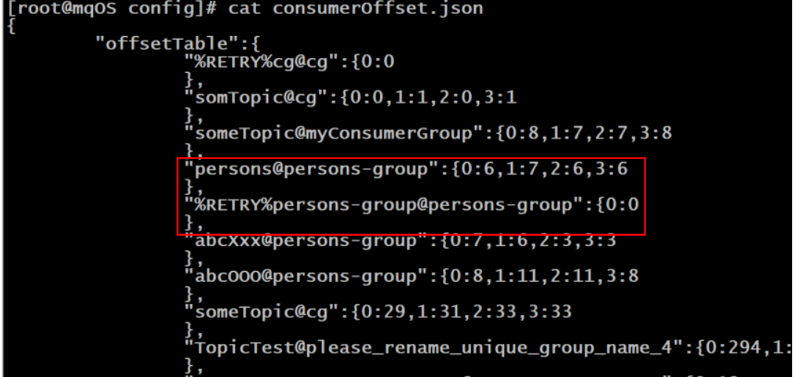
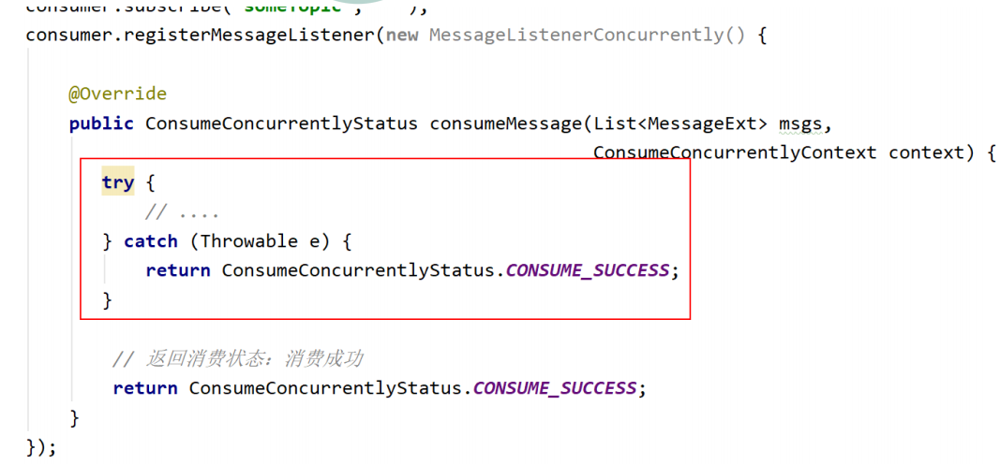

# 04RocketMQ的应用

## 一、普通消息

### 1、消息发送分类

Producer对于消息的发送方式也有多种选择，不同的方式会产生不同的系统效果。

#### 同步发送消息

同步发送消息是指，Producer发出⼀条消息后，会在收到MQ返回的ACK之后才发下⼀条消息。该方式的消息可靠性最高，但消息发送效率太低。


#### 异步发送消息

异步发送消息是指，Producer发出消息后无需等待MQ返回ACK，直接发送下⼀条消息。该方式的消息可靠性可以得到保障，消息发送效率也可以。



#### **单向发送消息**

单向发送消息是指，Producer仅负责发送消息，不等待、不处理MQ的ACK。该发送方式时MQ也不返回ACK。该方式的消息发送效率最高，但消息可靠性较差。



### 2、代码举例

#### 创建工程

创建一个Maven的Java工程rocketmq-test。

#### 导入依赖

导入rocketmq的client依赖。

```xml
<properties> 
    <project.build.sourceEncoding>UTF-8</project.build.sourceEncoding>
    <maven.compiler.source>1.8</maven.compiler.source> 
    <maven.compiler.target>1.8</maven.compiler.target> 
</properties> 
<dependencies> 
    <dependency> 
        <groupId>org.apache.rocketmq</groupId> 
        <artifactId>rocketmq-client</artifactId> 
        <version>4.8.0</version> 
    </dependency> 
</dependencies>
```

#### **定义同步消息发送生产者**

```java
public class SyncProducer { 
    public static void main(String[] args) throws Exception { 
        // 创建一个producer，参数为Producer Group名称 
        DefaultMQProducer producer = new DefaultMQProducer("pg"); 
        // 指定nameServer地址 
        producer.setNamesrvAddr("rocketmqOS:9876"); 
        // 设置当发送失败时重试发送的次数，默认为2次 
        producer.setRetryTimesWhenSendFailed(3); 
        // 设置发送超时时限为5s，默认3s 
        producer.setSendMsgTimeout(5000); 
        // 开启生产者 producer.start(); 
        // 生产并发送100条消息 
        for (int i = 0; i < 100; i++) { 
            byte[] body = ("Hi," + i).getBytes(); 
            Message msg = new Message("someTopic", "someTag", body); 
            // 为消息指定key msg.setKeys("key-" + i); 
            // 发送消息 SendResult sendResult = producer.send(msg); 
            System.out.println(sendResult);
            }
        // 关闭producer 
        producer.shutdown(); 
    } 
}
```

```java
// 消息发送的状态 
public enum SendStatus { 
    SEND_OK, 
    // 发送成功
    FLUSH_DISK_TIMEOUT, 
    // 刷盘超时。当Broker设置的刷盘策略为同步刷盘时才可能出 现这种异常状态。异步刷盘不会出现 
    FLUSH_SLAVE_TIMEOUT, 
    // Slave同步超时。当Broker集群设置的Master-Slave的复 制方式为同步复制时才可能出现这种异常状态。异步复制不会出现 
    SLAVE_NOT_AVAILABLE, 
    // 没有可用的Slave。当Broker集群设置为Master-Slave的 复制方式为同步复制时才可能出现这种异常状态。异步复制不会出现 
}
```

#### **定义异步消息发送生产者**

```java
public class AsyncProducer { 
    public static void main(String[] args) throws Exception { 
        DefaultMQProducer producer = new DefaultMQProducer("pg");
        producer.setNamesrvAddr("rocketmqOS:9876"); 
        // 指定异步发送失败后不进行重试发送 
        producer.setRetryTimesWhenSendAsyncFailed(0); 
        // 指定新创建的Topic的Queue数量为2，默认为4 
        producer.setDefaultTopicQueueNums(2); 
        producer.start(); 
        for (int i = 0; i < 100; i++) { 
            byte[] body = ("Hi," + i).getBytes(); 
            try {
                Message msg = new Message("myTopicA", "myTag", body); 
                // 异步发送。指定回调 
                producer.send(msg, new SendCallback() { 
                    // 当producer接收到MQ发送来的ACK后就会触发该回调方法的执行 
                    @Override public void onSuccess(SendResult sendResult) { 
                        System.out.println(sendResult); 
                    }
                    @Override public void onException(Throwable e) { 
                        e.printStackTrace(); 
                    }
                });
            } catch (Exception e) { 
                e.printStackTrace();
            }
        } 
        // end-for 
        // sleep一会儿 
        // 由于采用的是异步发送，所以若这里不sleep，
        // 则消息还未发送就会将producer给关闭，报错 
        TimeUnit.SECONDS.sleep(3); 
        producer.shutdown(); 
    } 
}
```

#### **定义单向消息发送生产者**

```java
public class OnewayProducer { 
    public static void main(String[] args) throws Exception{ 
        DefaultMQProducer producer = new DefaultMQProducer("pg"); 
        producer.setNamesrvAddr("rocketmqOS:9876"); 
        producer.start(); 
        for (int i = 0; i < 10; i++) { 
            byte[] body = ("Hi," + i).getBytes(); 
            Message msg = new Message("single", "someTag", body); 
            // 单向发送
            producer.sendOneway(msg); 
        }
        producer.shutdown(); 
        System.out.println("producer shutdown"); 
    } 
}
```

#### **定义消息消费者**

```java
public class SomeConsumer { 
    public static void main(String[] args) throws MQClientException { 
        // 定义一个pull消费者 
        // DefaultLitePullConsumer consumer = new DefaultLitePullConsumer("cg"); 
        // 定义一个push消费者 
        DefaultMQPushConsumer consumer = new DefaultMQPushConsumer("cg"); 
        // 指定nameServer 
        consumer.setNamesrvAddr("rocketmqOS:9876"); 
        // 指定从第一条消息开始消费
        consumer.setConsumeFromWhere(ConsumeFromWhere.CONSUME_FROM_FIRST_OFFSET ); 
        // 指定消费topic与tag 
        consumer.subscribe("someTopic", "*"); 
        // 指定采用“广播模式”进行消费，默认为“集群模式” 
        // consumer.setMessageModel(MessageModel.BROADCASTING); 
        // 注册消息监听器 
        consumer.registerMessageListener(new MessageListenerConcurrently() { 
            // 一旦broker中有了其订阅的消息就会触发该方法的执行， 
            // 其返回值为当前consumer消费的状态 
            @Override public ConsumeConcurrentlyStatus consumeMessage(List<MessageExt> msgs, ConsumeConcurrentlyContext context) { 
                // 逐条消费消息 
                for (MessageExt msg : msgs) { 
                    System.out.println(msg); 
                }
                // 返回消费状态：消费成功 
                return ConsumeConcurrentlyStatus.CONSUME_SUCCESS; 
            } 
        }); 
        // 开启消费者消费 
        consumer.start(); 
        System.out.println("Consumer Started"); 
    } 
}
```

## 二、顺序消息

### 1、什么是顺序消息

​		顺序消息指的是，严格按照消息的**发送顺序**进行消费的消息(FIFO)。

​		默认情况下生产者会把消息以Round Robin轮询方式发送到不同的Queue分区队列；而消费消息时会从多个Queue上拉取消息，这种情况下的发送和消费是不能保证顺序的。如果将消息仅发送到同一个Queue中，消费时也只从这个Queue上拉取消息，就严格保证了消息的顺序性。

### 2、为什么需要顺序消息

例如，现在有**TOPIC ORDER_STATUS** (订单状态)，其下有4个Queue队列，该Topic中的不同消息用于描述当前订单的不同状态。假设订单有状态：未支付、已支付、发货中、发货成功、发货失败。

根据以上订单状态，生产者从**时序**上可以生成如下几个消息：订单T0000001:未支付 --> 订单T0000001:已支付 --> 订单T0000001:发货中 --> 订单T0000001:发货失败

消息发送到MQ中之后，Queue的选择如果采用轮询策略，消息在MQ的存储可能如下：


这种情况下，我们希望Consumer消费消息的顺序和我们发送是一致的，然而上述MQ的投递和消费方式，我们无法保证顺序是正确的。对于顺序异常的消息，Consumer即使设置有一定的状态容错，也不能完全处理好这么多种随机出现组合情况。


基于上述的情况，可以设计如下方案：对于相同订单号的消息，通过一定的策略，将其放置在一个Queue中，然后消费者再采用一定的策略（例如，一个线程独立处理一个queue，保证处理消息的顺序性），能够保证消费的顺序性。

### 3、有序性的分类

根据有序范围的不同，RocketMQ可以严格地保证两种消息的有序性：分区有序与全局有序。

#### 全局有序


当发送和消费参与的Queue只有一个时所保证的有序是整个Topic中消息的顺序， 称为全局有序。 

> 在创建*Topic*时指定*Queue*的数量。有三种指定方式： 
>
> *1*）在代码中创建*Producer*时，可以指定其自动创建的*Topic*的*Queue*数量 
>
> *2*）在*RocketMQ*可视化控制台中手动创建*Topic*时指定*Queue*数量 
>
> *3*）使用*mqadmin*命令手动创建*Topic*时指定*Queue*数量

#### 分区有序



如果有多个Queue参与，其仅可保证在该Queue分区队列上的消息顺序，则称为分区有序。 

> 如何实现*Queue*的选择？在定义*Producer*时我们可以指定消息队列选择器，而这个选择器是我们自己实现了*MessageQueueSelector*接口定义的。 
>
> 在定义选择器的选择算法时，一般需要使用选择*key*。这个选择*key*可以是消息*key*也可以是其它数据。但无论谁做选择*key*，都不能重复，都是唯一的。
>
> 一般性的选择算法是，让选择*key*（或其*hash*值）与该*Topic*所包含的*Queue*的数量取模，其结果即为选择出的*Queue*的*QueueId*。
>
>  
>
> 取模算法存在一个问题：不同选择*key*与*Queue*数量取模结果可能会是相同的，即不同选择*key*的消息可能会出现在相同的*Queue*，即同一个*Consuemr*可能会消费到不同选择*key*的消息。这个问题如何解决？一般性的作法是，从消息中获取到选择*key*，对其进行判断。若是当前*Consumer*需要消费的消息，则直接消费，否则什么也不做。这种做法要求选择*key*要能够随着消息一起被*Consumer*获取到。此时使用消息*key*作为选择*key*是比较好的做法。
>
> 以上做法会不会出现如下新的问题呢？不属于那个*Consumer*的消息被拉取走了，那么应该消费该消息的*Consumer*是否还能再消费该消息呢？同一个*Queue*中的消息不可能被同一个*Group*中的不同*Consumer*同时消费。所以，消费现一个*Queue*的不同选择*key*的消息的*Consumer*一定属于不同的*Group*。而不同的*Group*中的*Consumer*间的消费是相互隔离的，互不影响的。

### 4、代码举例

```java
public class OrderedProducer { 
    public static void main(String[] args) throws Exception { 
        DefaultMQProducer producer = new DefaultMQProducer("pg"); 
        producer.setNamesrvAddr("rocketmqOS:9876"); 
        producer.start(); 
        for (int i = 0; i < 100; i++) { 
            Integer orderId = i; 
            byte[] body = ("Hi," + i).getBytes(); 
            Message msg = new Message("TopicA", "TagA", body); 
            SendResult sendResult = producer.send(msg, new MessageQueueSelector() { 
                @Override public MessageQueue select(List<MessageQueue> mqs, Message msg, Object arg) {
                    Integer id = (Integer) arg; 
                    int index = id % mqs.size(); 
                    return mqs.get(index); 
                } 
            }, orderId); 
            System.out.println(sendResult); 
        }
        producer.shutdown(); 
    }
}
```

## 三、延时消息

### 1、什么是延时消息

当消息写入到Broker后，在指定的时长后才可被消费处理的消息，称为延时消息。

采用RocketMQ的延时消息可以实现**定时任务**的功能，而无需使用定时器。典型的应用场景是，电商交易中超时未支付关闭订单的场景，12306平台订票超时未支付取消订票的场景。

> 在电商平台中，订单创建时会发送一条延迟消息。这条消息将会在*30*分钟后投递给后台业务系统（*Consumer*），后台业务系统收到该消息后会判断对应的订单是否已经完成支付。如果未完成，则取消订单，将商品再次放回到库存；如果完成支付，则忽略。 
>
> 在*12306*平台中，车票预订成功后就会发送一条延迟消息。这条消息将会在*45*分钟后投递给后台业务系统（*Consumer*），后台业务系统收到该消息后会判断对应的订单是否已经完成支付。如果未完成，则取消预订，将车票再次放回到票池；如果完成支付，则忽略。

### 2、延时等级

延时消息的延迟时长**不支持随意时长**的延迟，是通过特定的延迟等级来指定的。延时等级定义在RocketMQ服务端的**MessageStoreConfig**类中的如下变量中：


即，若指定的延时等级为3，则表示延迟时长为10s，即延迟等级是从1开始计数的。

当然，如果需要自定义的延时等级，可以通过在broker加载的配置中新增如下配置（例如下面增加了1天这个等级1d）。配置文件在RocketMQ安装目录下的conf目录中。

```
messageDelayLevel = 1s 5s 10s 30s 1m 2m 3m 4m 5m 6m 7m 8m 9m 10m 20m 30m 1h 2h 1d
```

### 3、延时消息实现原理



具体实现方案是：

#### **修改消息**



Producer将消息发送到Broker后，Broker会首先将消息写入到commitlog文件，然后需要将其分发到相应的consumequeue。不过，在分发之前，系统会先判断消息中是否带有延时等级。若没有，则直接正常分发；若有则需要经历一个复杂的过程：

- 修改消息的Topic为SCHEDULE_TOPIC_XXXX

- 根据延时等级，在consumequeue目录中SCHEDULE_TOPIC_XXXX主题下创建出相应的queueId目录与consumequeue文件（如果没有这些目录与文件的话）。

  > 延迟等级*delayLevel*与*queueId*的对应关系为*queueId = delayLevel -1* 
  >
  > 需要注意，在创建*queueId*目录时，并不是一次性地将所有延迟等级对应的目录全部创建完毕，而是用到哪个延迟等级创建哪个目录

  

- 修改消息索引单元内容。索引单元中的Message Tag HashCode部分原本存放的是消息的Tag的Hash值。现修改为消息的投递时间。投递时间是指该消息被重新修改为原Topic后再次被写入到commitlog中的时间。投递时间 = 消息存储时间 + 延时等级时间。消息存储时间指的是消息被发送到Broker时的时间戳。

- 将消息索引写入到SCHEDULE_TOPIC_XXXX主题下相应的consumequeue中 

  > *SCHEDULE_TOPIC_XXXX*目录中各个延时等级*Queue*中的消息是如何排序的？
  >
  > 是按照消息投递时间排序的。一个*Broker*中同一等级的所有延时消息会被写入到*consumequeue*目录中*SCHEDULE_TOPIC_XXXX*目录下相同*Queue*中。即一个*Queue*中消息投递时间的延迟等级时间是相同的。那么投递时间就取决于于**消息存储时间**了。即按照消息被发送到*Broker*的时间进行排序的。

#### 投递延时消息

​		Broker内部有⼀个延迟消息服务类ScheuleMessageService，其会消费SCHEDULE_TOPIC_XXXX中的消息，即按照每条消息的投递时间，将延时消息投递到⽬标Topic中。不过，在投递之前会从commitlog中将原来写入的消息再次读出，并将其原来的延时等级设置为0，即原消息变为了一条不延迟的普通消息。然后再次将消息投递到目标Topic中。

> *ScheuleMessageService*在*Broker*启动时，会创建并启动一个定时器*TImer*，用于执行相应的定时任务。系统会根据延时等级的个数，定义相应数量的*TimerTask*，每个*TimerTask*负责一个延迟等级消息的消费与投递。每个*TimerTask*都会检测相应*Queue*队列的第一条消息是否到期。若第一条消息未到期，则后面的所有消息更不会到期（消息是按照投递时间排序的）；若第一条消息到期了，则将该消息投递到目标*Topic*，即消费该消息。

#### 将消息重新写入commitlog

延迟消息服务类ScheuleMessageService将延迟消息再次发送给了commitlog，并再次形成新的消息索引条目，分发到相应Queue。 

> 这其实就是一次普通消息发送。只不过这次的消息*Producer*是延迟消息服务类*ScheuleMessageService*。

### 4、代码举例

#### 定义DelayProducer类

```java
public class DelayProducer { 
    public static void main(String[] args) throws Exception { 
        DefaultMQProducer producer = new DefaultMQProducer("pg"); 
        producer.setNamesrvAddr("rocketmqOS:9876"); 
        producer.start(); 
        for (int i = 0; i < 10; i++) { 
            byte[] body = ("Hi," + i).getBytes(); 
            Message msg = new Message("TopicB", "someTag", body); 
            // 指定消息延迟等级为3级，即延迟10s 
            // msg.setDelayTimeLevel(3); 
            SendResult sendResult = producer.send(msg); 
            // 输出消息被发送的时间 
            System.out.print(new SimpleDateFormat("mm:ss").format(new Date())); 
            System.out.println(" ," + sendResult); }producer.shutdown(); 
    } 
}
```

#### 定义OtherConsumer类

```java
public class OtherConsumer { 
    public static void main(String[] args) throws MQClientException { 
        DefaultMQPushConsumer consumer = new DefaultMQPushConsumer("cg"); 
        consumer.setNamesrvAddr("rocketmqOS:9876"); 
        consumer.setConsumeFromWhere(ConsumeFromWhere.CONSUME_FROM_FIRST_OFFSET ); 
        consumer.subscribe("TopicB", "*"); 
        consumer.registerMessageListener(new MessageListenerConcurrently() { 
            @Override public ConsumeConcurrentlyStatus consumeMessage(List<MessageExt> msgs, ConsumeConcurrentlyContext context) { 
                for (MessageExt msg : msgs) { 
                    // 输出消息被消费的时间
                    System.out.print(new SimpleDateFormat("mm:ss").format(new Date())); 
                    System.out.println(" ," + msg); }
                return ConsumeConcurrentlyStatus.CONSUME_SUCCESS; 
            } 
        });
        consumer.start(); 
        System.out.println("Consumer Started"); 
    } 
}
```

## 四、事务消息

### 1、问题引入

这里的一个需求场景是：工行用户A向建行用户B转账1万元。

我们可以使用同步消息来处理该需求场景：


1. 工行系统发送一个给B增款1万元的同步消息M给Broker 

2. 消息被Broker成功接收后，向工行系统发送成功ACK 

3. 工行系统收到成功ACK后从用户A中扣款1万元

4. 建行系统从Broker中获取到消息M 

5. 建行系统消费消息M，即向用户B中增加1万元

> 这其中是有问题的：若第*3*步中的扣款操作失败，但消息已经成功发送到了*Broker*。对于*MQ*来 说，只要消息写入成功，那么这个消息就可以被消费。此时建行系统中用户*B*增加了*1*万元。出现了数据不一致问题。

### 2、解决思路

​		解决思路是，让第1、2、3步具有原子性，要么全部成功，要么全部失败。即消息发送成功后，必须要保证扣款成功。如果扣款失败，则回滚发送成功的消息。而该思路即使用事务消息。这里要使用分布式事务解决方案。


使用事务消息来处理该需求场景：

1. 事务管理器TM向事务协调器TC发起指令，开启全局事务

2. 工行系统发一个给B增款1万元的事务消息M给TC 

3. TC会向Broker发送半事务消息prepareHalf，将消息M预提交到Broker。此时的建行系统是看不到Broker中的消息M的 

4. Broker会将预提交执行结果Report给TC。 

5. 如果预提交失败，则TC会向TM上报预提交失败的响应，全局事务结束；如果预提交成功，TC会调用工行系统的回调操作，去完成工行用户A的预扣款1万元的操作

6. 工行系统会向TC发送预扣款执行结果，即本地事务的执行状态

7. TC收到预扣款执行结果后，会将结果上报给TM。 

> 预扣款执行结果存在三种可能性： 
>
> ```java
> // 描述本地事务执行状态 
> public enum LocalTransactionState { 
>     COMMIT_MESSAGE, 
>     // 本地事务执行成功 
>     ROLLBACK_MESSAGE, 
>     // 本地事务执行失败 
>     UNKNOW, 
>     // 不确定，表示需要进行回查以确定本地事务的执行结果 
> }
> ```

8. TM会根据上报结果向TC发出不同的确认指令

- 若预扣款成功（本地事务状态为COMMIT_MESSAGE），则TM向TC发送Global Commit指令

- 若预扣款失败（本地事务状态为ROLLBACK_MESSAGE），则TM向TC发送Global Rollback指令

- 若现未知状态（本地事务状态为UNKNOW），则会触发工行系统的本地事务状态回查操作。回查操作会将回查结果，即COMMIT_MESSAGE或ROLLBACK_MESSAGE Report给TC。TC将结果上报给TM，TM会再向TC发送最终确认指令Global Commit或Global Rollback 

9. TC在接收到指令后会向Broker与工行系统发出确认指令

- TC接收的若是Global Commit指令，则向Broker与工行系统发送Branch Commit指令。此时Broker中的消息M才可被建行系统看到；此时的工行用户A中的扣款操作才真正被确认

- TC接收到的若是Global Rollback指令，则向Broker与工行系统发送Branch Rollback指令。此时Broker中的消息M将被撤销；工行用户A中的扣款操作将被回滚

> 以上方案就是为了确保消息投递与扣款操作能够在一个事务中，要成功都成功，有一个失败，则全部回滚。
>
> 以上方案并不是一个典型的*XA*模式。因为*XA*模式中的分支事务是异步的，而事务消息方案中的消息预提交与预扣款操作间是同步的。

### 3、基础

#### **分布式事务**

对于分布式事务，通俗地说就是，一次操作由若干分支操作组成，这些分支操作分属不同应用，分布在不同服务器上。分布式事务需要保证这些分支操作要么全部成功，要么全部失败。分布式事务与普通事务一样，就是为了保证操作结果的一致性。

#### **事务消息**

RocketMQ提供了类似X/Open XA的分布式事务功能，通过事务消息能达到分布式事务的最终一致。XA是一种分布式事务解决方案，一种分布式事务处理模式。

#### **半事务消息**

暂不能投递的消息，发送方已经成功地将消息发送到了Broker，但是Broker未收到最终确认指令，此时该消息被标记成“暂不能投递”状态，即不能被消费者看到。处于该种状态下的消息即半事务消息。

#### **本地事务状态**

Producer**回调操作**执行的结果为本地事务状态，其会发送给TC，而TC会再发送给TM。TM会根据TC发送来的本地事务状态来决定全局事务确认指令。

```java
// 描述本地事务执行状态
public enum LocalTransactionState { 
    COMMIT_MESSAGE, 
    // 本地事务执行成功 
    ROLLBACK_MESSAGE,
    // 本地事务执行失败 
    UNKNOW, 
    // 不确定，表示需要进行回查以确定本地事务的执行结果 
}
```

#### **消息回查**



消息回查，即重新查询本地事务的执行状态。本例就是重新到DB中查看预扣款操作是否执行成功。

> 注意，消息回查不是重新执行回调操作。回调操作是进行预扣款操作，而消息回查则是查看预扣款操作执行的结果。 
>
> 引发消息回查的原因最常见的有两个： 
>
> *1)*回调操作返回*UNKNWON* 
>
> *2)TC*没有接收到*TM*的最终全局事务确认指令 

#### RocketMQ中的消息回查设置

关于消息回查，有三个常见的属性设置。它们都在broker加载的配置文件中设置，例如：

- transactionTimeout=20，指定TM在20秒内应将最终确认状态发送给TC，否则引发消息回查。默认为60秒 

- transactionCheckMax=5，指定最多回查5次，超过后将丢弃消息并记录错误日志。默认15次。

- transactionCheckInterval=10，指定设置的多次消息回查的时间间隔为10秒。默认为60秒。

### 4 XA模式三剑客

#### XA协议

XA（Unix Transaction）是一种分布式事务解决方案，一种分布式事务处理模式，是基于XA协议的。XA协议由Tuxedo（Transaction for Unix has been Extended for Distributed Operation，分布式操作扩展之后的Unix事务系统）首先提出的，并交给X/Open组织，作为资源管理器与事务管理器的接口标准。

XA模式中有三个重要组件：TC、TM、RM。

#### TC

Transaction Coordinator，事务协调者。维护全局和分支事务的状态，驱动全局事务提交或回滚。

> *RocketMQ*中*Broker*充当着*TC*。 

#### **TM**

Transaction Manager，事务管理器。定义全局事务的范围：开始全局事务、提交或回滚全局事务。它实际是全局事务的发起者。

> *RocketMQ*中事务消息的*Producer*充当着*TM*。

#### **RM**

Resource Manager，资源管理器。管理分支事务处理的资源，与TC交谈以注册分支事务和报告分支事务的状态，并驱动分支事务提交或回滚。

> *RocketMQ*中事务消息的*Producer*及*Broker*均是*RM*。

### 5、XA模式架构



XA模式是一个典型的2PC，其执行原理如下：

1. TM向TC发起指令，开启一个全局事务。

2. 根据业务要求，各个RM会逐个向TC注册分支事务，然后TC会逐个向RM发出预执行指令。

3. 各个RM在接收到指令后会在进行本地事务预执行。

4. RM将预执行结果Report给TC。当然，这个结果可能是成功，也可能是失败。

5. TC在接收到各个RM的Report后会将汇总结果上报给TM，根据汇总结果TM会向TC发出确认指令。

- 若所有结果都是成功响应，则向TC发送Global Commit指令。

- 只要有结果是失败响应，则向TC发送Global Rollback指令。

6. TC在接收到指令后再次向RM发送确认指令。

> 事务消息方案并不是一个典型的*XA*模式。因为*XA*模式中的分支事务是异步的，而事务消息方案中的消息预提交与预扣款操作间是同步的。

### 6、注意

- 事务消息不支持延时消息

- 对于事务消息要做好幂等性检查，因为事务消息可能不止一次被消费（因为存在回滚后再提交的情况）

### 7、代码举例

#### **定义工行事务监听器**

```java
public class ICBCTransactionListener implements TransactionListener { 
    // 回调操作方法 
    // 消息预提交成功就会触发该方法的执行，用于完成本地事务 
    @Override public LocalTransactionState executeLocalTransaction(Message msg, Object arg) { 
        System.out.println("预提交消息成功：" + msg); 
        // 假设接收到TAGA的消息就表示扣款操作成功，TAGB的消息表示扣款失败， 
        // TAGC表示扣款结果不清楚，需要执行消息回查 
        if (StringUtils.equals("TAGA", msg.getTags())) { 
            return LocalTransactionState.COMMIT_MESSAGE; 
        } else if (StringUtils.equals("TAGB", msg.getTags())) { 
            return LocalTransactionState.ROLLBACK_MESSAGE; 
        } else if (StringUtils.equals("TAGC", msg.getTags())) { 
            return LocalTransactionState.UNKNOW; 
        }
        return LocalTransactionState.UNKNOW;
    }
    // 消息回查方法 
    // 引发消息回查的原因最常见的有两个： 
    // 1)回调操作返回UNKNWON 
    // 2)TC没有接收到TM的最终全局事务确认指令 
    @Override public LocalTransactionState checkLocalTransaction(MessageExt msg) { 
        System.out.println("执行消息回查" + msg.getTags());
        return LocalTransactionState.COMMIT_MESSAGE; 
    } 
}
```

#### **定义事物消息生产者**

```java
public class TransactionProducer { 
    public static void main(String[] args) throws Exception { 
        TransactionMQProducer producer = new TransactionMQProducer("tpg"); 
        producer.setNamesrvAddr("rocketmqOS:9876"); 
        /*** 定义一个线程池 
        * @param corePoolSize 线程池中核心线程数量 
        * @param maximumPoolSize 线程池中最多线程数 
        * @param keepAliveTime 这是一个时间。当线程池中线程数量大于核心线程数量 是，
        * 多余空闲线程的存活时长 
        * @param unit 时间单位 
        * @param workQueue 临时存放任务的队列，其参数就是队列的长度 
        * @param threadFactory 线程工厂 
        */ 
        ExecutorService executorService = new ThreadPoolExecutor(2, 5, 100, TimeUnit.SECONDS, new ArrayBlockingQueue<Runnable>(2000), new ThreadFactory() { 
            @Override public Thread newThread(Runnable r) { 
                Thread thread = new Thread(r); 
                thread.setName("client-transaction-msg-check-thread"); 
                return thread; 
            } 
        }); 
        // 为生产者指定一个线程池 
        producer.setExecutorService(executorService); 
        // 为生产者添加事务监听器 
        producer.setTransactionListener(new ICBCTransactionListener()); 
        producer.start(); 
        String[] tags = {"TAGA","TAGB","TAGC"}; 
        for (int i = 0; i < 3; i++) { 
            byte[] body = ("Hi," + i).getBytes(); 
            Message msg = new Message("TTopic", tags[i], body); 
            // 发送事务消息 
            // 第二个参数用于指定在执行本地事务时要使用的业务参数 
            SendResult sendResult = producer.sendMessageInTransaction(msg,null);
            System.out.println("发送结果为：" + sendResult.getSendStatus()); 
        } 
    } 
}
```

#### **定义消费者**

直接使用普通消息的SomeConsumer作为消费者即可。

```java
public class SomeConsumer { 
    public static void main(String[] args) throws MQClientException { 
        // 定义一个pull消费者
        // DefaultLitePullConsumer consumer = new DefaultLitePullConsumer("cg"); 
        // 定义一个push消费者 
        DefaultMQPushConsumer consumer = new DefaultMQPushConsumer("cg"); 
        // 指定nameServer 
        consumer.setNamesrvAddr("rocketmqOS:9876"); 
        // 指定从第一条消息开始消费 
        consumer.setConsumeFromWhere(ConsumeFromWhere.CONSUME_FROM_FIRST_OFFSET ); 
        // 指定消费topic与tag 
        consumer.subscribe("TTopic", "*"); 
        // 指定采用“广播模式”进行消费，默认为“集群模式” 
        // consumer.setMessageModel(MessageModel.BROADCASTING); 
        // 注册消息监听器 
        consumer.registerMessageListener(new MessageListenerConcurrently() { 
            // 一旦broker中有了其订阅的消息就会触发该方法的执行， 
            // 其返回值为当前consumer消费的状态 
            @Override public ConsumeConcurrentlyStatus consumeMessage(List<MessageExt> msgs, ConsumeConcurrentlyContext context) { 
                // 逐条消费消息
                for (MessageExt msg : msgs) { 
                    System.out.println(msg); 
                }
                // 返回消费状态：消费成功 
                return ConsumeConcurrentlyStatus.CONSUME_SUCCESS; 
            }
        });
        // 开启消费者消费 
        consumer.start(); 
        System.out.println("Consumer Started"); 
    } 
}
```

## 五、批量消息

### 1、批量发送消息

#### 发送限制

生产者进行消息发送时可以一次发送多条消息，这可以大大提升Producer的发送效率。不过需要注意以下几点：

- 批量发送的消息必须具有相同的Topic

- 批量发送的消息必须具有相同的刷盘策略

- 批量发送的消息不能是延时消息与事务消息

#### **批量发送大小**

默认情况下，一批发送的消息总大小不能超过4MB字节。如果想超出该值，有两种解决方案：

- 方案一：将批量消息进行拆分，拆分为若干不大于4M的消息集合分多次批量发送

- 方案二：在Producer端与Broker端修改属性

Producer端需要在发送之前设置Producer的maxMessageSize属性

Broker端需要修改其加载的配置文件中的maxMessageSize属性

#### **生产者发送的消息大小**


生产者通过send()方法发送的Message，并不是直接将Message序列化后发送到网络上的，而是通过这个Message生成了一个字符串发送出去的。这个字符串由四部分构成：Topic、消息Body、消息日志（占20字节），及用于描述消息的一堆属性key-value。这些属性中包含例如生产者地址、生产时间、要发送的QueueId等。最终写入到Broker中消息单元中的数据都是来自于这些属性。

### 2、批量消费消息

#### 修改批量属性


Consumer的MessageListenerConcurrently监听接口的consumeMessage()方法的第一个参数为消息列表，但默认情况下每次只能消费一条消息。若要使其一次可以消费多条消息，则可以通过修改Consumer的consumeMessageBatchMaxSize属性来指定。不过，该值不能超过32。因为默认情况下消费者每次可以拉取的消息最多是32条。若要修改一次拉取的最大值，则可通过修改Consumer的

pullBatchSize属性来指定。

#### 存在的问题

Consumer的pullBatchSize属性与consumeMessageBatchMaxSize属性是否设置的越大越好？当然不是。

- pullBatchSize值设置的越大，Consumer每拉取一次需要的时间就会越长，且在网络上传输出现问题的可能性就越高。若在拉取过程中若出现了问题，那么本批次所有消息都需要全部重新拉取。

- consumeMessageBatchMaxSize值设置的越大，Consumer的消息并发消费能力越低，且这批被消费的消息具有相同的消费结果。因为consumeMessageBatchMaxSize指定的一批消息只会使用一个线程进行处理，且在处理过程中只要有一个消息处理异常，则这批消息需要全部重新再次消费处理。

### 3、代码举例

该批量发送的需求是，不修改最大发送4M的默认值，但要防止发送的批量消息超出4M的限制。

#### **定义消息列表分割器**

```java
// 消息列表分割器：其只会处理每条消息的大小不超4M的情况。 
// 若存在某条消息，其本身大小大于4M，这个分割器无法处理， 
// 其直接将这条消息构成一个子列表返回。并没有再进行分割 
public class MessageListSplitter implements Iterator<List<Message>> { 
    // 指定极限值为4M 
    private final int SIZE_LIMIT = 4 *1024 * 1024; 
    // 存放所有要发送的消息
    private final List<Message> messages; 
    // 要进行批量发送消息的小集合起始索引 
    private int currIndex; 
    public MessageListSplitter(List<Message> messages) { 
        this.messages = messages;
        }
    @Override 
    public boolean hasNext() {
        // 判断当前开始遍历的消息索引要小于消息总数 
        return currIndex < messages.size();
    }
    @Override 
    public List<Message> next() { 
        int nextIndex = currIndex; 
        // 记录当前要发送的这一小批次消息列表的大小 
        int totalSize = 0; 
        for (; nextIndex < messages.size(); nextIndex++) { 
            // 获取当前遍历的消息 
            Message message = messages.get(nextIndex); 
            // 统计当前遍历的message的大小
            int tmpSize = message.getTopic().length() + message.getBody().length; 
            Map<String, String> properties = message.getProperties(); 
            for (Map.Entry<String, String> entry : properties.entrySet()) { 
                tmpSize += entry.getKey().length() + entry.getValue().length(); 
            }
            tmpSize = tmpSize + 20; 
            // 判断当前消息本身是否大于4M 
            if (tmpSize > SIZE_LIMIT) { 
                if (nextIndex - currIndex == 0) {
                    nextIndex++; 
                }
                break; 
            }
            if (tmpSize + totalSize > SIZE_LIMIT) { 
                break;
            } else { 
                totalSize += tmpSize; 
            } 
        } // end-for 
        // 获取当前messages列表的子集合[currIndex, nextIndex) 
        List<Message> subList = messages.subList(currIndex, nextIndex); 
        // 下次遍历的开始索引 
        currIndex = nextIndex;
        return subList; 
    } 
}
```

#### **定义批量消息生产者**

```java
public class BatchProducer { 
    public static void main(String[] args) throws Exception { 
        DefaultMQProducer producer = new DefaultMQProducer("pg"); 
        producer.setNamesrvAddr("rocketmqOS:9876"); 
        // 指定要发送的消息的最大大小，默认是4M 
        // 不过，仅修改该属性是不行的，还需要同时修改broker加载的配置文件中的 
        // maxMessageSize属性 
        // producer.setMaxMessageSize(8 * 1024 * 1024); 
        producer.start(); 
        // 定义要发送的消息集合 
        List<Message> messages = new ArrayList<>(); 
        for (int i = 0; i < 100; i++) { 
            byte[] body = ("Hi," + i).getBytes();
            Message msg = new Message("someTopic", "someTag", body); 
            messages.add(msg); 
        }
        // 定义消息列表分割器，将消息列表分割为多个不超出4M大小的小列表 
        MessageListSplitter splitter = new MessageListSplitter(messages); 
        while (splitter.hasNext()) { 
            try {
                List<Message> listItem = splitter.next(); 
                producer.send(listItem); 
            } catch (Exception e) {
                e.printStackTrace(); 
            } 
        }
        producer.shutdown();
    } 
}
```

#### **定义批量消息消费者**

```java
public class BatchConsumer { 
    public static void main(String[] args) throws MQClientException {
        DefaultMQPushConsumer consumer = new DefaultMQPushConsumer("cg");
        consumer.setNamesrvAddr("rocketmqOS:9876");
        consumer.setConsumeFromWhere(ConsumeFromWhere.CONSUME_FROM_FIRST_OFFSET ); 
        consumer.subscribe("someTopicA", "*"); 
        // 指定每次可以消费10条消息，默认为1 
        consumer.setConsumeMessageBatchMaxSize(10); 
        // 指定每次可以从Broker拉取40条消息，默认为32 
        consumer.setPullBatchSize(40); 
        consumer.registerMessageListener(new MessageListenerConcurrently() { 
            @Override 
            public ConsumeConcurrentlyStatus consumeMessage(List<MessageExt> msgs, ConsumeConcurrentlyContext context) { 
                for (MessageExt msg : msgs) { 
                    System.out.println(msg); 
                }
                // 消费成功的返回结果 
                return ConsumeConcurrentlyStatus.CONSUME_SUCCESS; 
                // 消费异常时的返回结果 
                // return ConsumeConcurrentlyStatus.RECONSUME_LATER; 
            } 
        });
        consumer.start(); 
        System.out.println("Consumer Started"); 
    } 
}
```

## 六、消息过滤

消息者在进行消息订阅时，除了可以指定要订阅消息的Topic外，还可以对指定Topic中的消息根据指定条件进行过滤，即可以订阅比Topic更加细粒度的消息类型。

对于指定Topic消息的过滤有两种过滤方式：Tag过滤与SQL过滤。

### 1、Tag过滤

通过consumer的subscribe()方法指定要订阅消息的Tag。如果订阅多个Tag的消息，Tag间使用或运算符(双竖线||)连接。

```java
DefaultMQPushConsumer consumer = new DefaultMQPushConsumer("CID_EXAMPLE"); 
consumer.subscribe("TOPIC", "TAGA || TAGB || TAGC");
```

### 2、SQL过滤

SQL过滤是一种通过特定表达式对事先埋入到消息中的用户属性进行筛选过滤的方式。通过SQL过滤，可以实现对消息的复杂过滤。不过，只有使用PUSH模式的消费者才能使用SQL过滤。

SQL过滤表达式中支持多种常量类型与运算符。

支持的常量类型：

- 数值：比如：123，3.1415

- 字符：必须用单引号包裹起来，比如：'abc'

- 布尔：TRUE 或 FALSE 

- NULL：特殊的常量，表示空

支持的运算符有：

- 数值比较：>，>=，<，<=，BETWEEN，=

- 字符比较：=，<>，IN

- 逻辑运算 ：AND，OR，NOT 

- NULL判断：IS NULL 或者 IS NOT NULL

默认情况下Broker没有开启消息的SQL过滤功能，需要在Broker加载的配置文件中添加如下属性，以开启该功能：

```
enablePropertyFilter = true
```

在启动Broker时需要指定这个修改过的配置文件。例如对于单机Broker的启动，其修改的配置文件是conf/broker.conf，启动时使用如下命令：

```
sh bin/mqbroker -n localhost:9876 -c conf/broker.conf & 
```

### 3、代码举例

#### 定义Tag过滤Producer

```java
public class FilterByTagProducer { 
    public static void main(String[] args) throws Exception {
        DefaultMQProducer producer = new DefaultMQProducer("pg"); 
        producer.setNamesrvAddr("rocketmqOS:9876");
        producer.start(); 
        String[] tags = {"myTagA","myTagB","myTagC"}; 
        for (int i = 0; i < 10; i++) {
            byte[] body = ("Hi," + i).getBytes(); 
            String tag = tags[i%tags.length];
            Message msg = new Message("myTopic",tag,body);
            SendResult sendResult = producer.send(msg); 
            System.out.println(sendResult); 
        }
        producer.shutdown(); 
    } 
}
```

#### 定义Tag过滤Consumer

```java
public class FilterByTagConsumer { 
    public static void main(String[] args) throws Exception { 
        DefaultMQPushConsumer consumer = new DefaultMQPushConsumer("pg");
        consumer.setNamesrvAddr("rocketmqOS:9876"); 
        consumer.setConsumeFromWhere(ConsumeFromWhere.CONSUME_FROM_FIRST_OFFSET );
        consumer.subscribe("myTopic", "myTagA || myTagB"); 
        consumer.registerMessageListener(new MessageListenerConcurrently() { 
            @Override 
            public ConsumeConcurrentlyStatus consumeMessage(List<MessageExt> msgs, ConsumeConcurrentlyContext context) { 
                for (MessageExt me:msgs){
                    System.out.println(me); 
                }
                return ConsumeConcurrentlyStatus.CONSUME_SUCCESS; 
            }
        }); 
        consumer.start();
        System.out.println("Consumer Started");
    }
}
```

#### 定义SQL过滤Producer

```java
public class FilterBySQLProducer { 
    public static void main(String[] args) throws Exception { 
        DefaultMQProducer producer = new DefaultMQProducer("pg"); 
        producer.setNamesrvAddr("rocketmqOS:9876");
        producer.start();
        for (int i = 0; i < 10; i++) { 
            try {byte[] body = ("Hi," + i).getBytes(); 
                 Message msg = new Message("myTopic", "myTag", body); 
                 msg.putUserProperty("age", i + ""); 
                 SendResult sendResult = producer.send(msg); 
                 System.out.println(sendResult); 
                } catch (Exception e) { 
                e.printStackTrace(); 
            } 
        }
        producer.shutdown(); 
    } 
}

```

#### 定义SQL过滤Consumer

```java
public class FilterBySQLConsumer { 
    public static void main(String[] args) throws Exception {
        DefaultMQPushConsumer consumer = new DefaultMQPushConsumer("pg"); 
        consumer.setNamesrvAddr("rocketmqOS:9876"); 
        consumer.setConsumeFromWhere(ConsumeFromWhere.CONSUME_FROM_FIRST_OFFSET ); 
        consumer.subscribe("myTopic", MessageSelector.bySql("age between 0 and 6"));
        consumer.registerMessageListener(new MessageListenerConcurrently() { 
            @Override 
            public ConsumeConcurrentlyStatus consumeMessage(List<MessageExt> msgs, ConsumeConcurrentlyContext context) { 
                for (MessageExt me:msgs){ 
                    System.out.println(me);
                }
                return ConsumeConcurrentlyStatus.CONSUME_SUCCESS; 
            }
        }); 
        consumer.start(); 
        System.out.println("Consumer Started");
    }
}
```

## 七、消息发送重试机制

### 1、说明

Producer对发送失败的消息进行重新发送的机制，称为消息发送重试机制，也称为消息重投机制。

对于消息重投，需要注意以下几点：

- 生产者在发送消息时，若采用同步或异步发送方式，发送失败会重试，但oneway消息发送方式发送失败是没有重试机制的

- 只有普通消息具有发送重试机制，顺序消息是没有的

- 消息重投机制可以保证消息尽可能发送成功、不丢失，但可能会造成消息重复。消息重复在RocketMQ中是无法避免的问题

- 消息重复在一般情况下不会发生，当出现消息量大、网络抖动，消息重复就会成为大概率事件producer主动重发、consumer负载变化（发生Rebalance，不会导致消息重复，但可能出现重复消费）也会导致重复消息

- 消息重复无法避免，但要避免消息的重复消费。

- 避免消息重复消费的解决方案是，为消息添加唯一标识（例如消息key），使消费者对消息进行消费判断来避免重复消费

- 消息发送重试有三种策略可以选择：同步发送失败策略、异步发送失败策略、消息刷盘失败策略

### 2、同步发送失败策略

​		对于普通消息，消息发送默认采用round-robin策略来选择所发送到的队列。如果发送失败，默认重试2次。但在重试时是不会选择上次发送失败的Broker，而是选择其它Broker。当然，若只有一个Broker其也只能发送到该Broker，但其会尽量发送到该Broker上的其它Queue。

```java
// 创建一个producer，参数为Producer Group名称 
DefaultMQProducer producer = new DefaultMQProducer("pg");
// 指定nameServer地址 
producer.setNamesrvAddr("rocketmqOS:9876"); 
// 设置同步发送失败时重试发送的次数，默认为2次 
producer.setRetryTimesWhenSendFailed(3); 
// 设置发送超时时限为5s，默认3s 
producer.setSendMsgTimeout(5000);
```

同时，Broker还具有失败隔离功能，使Producer尽量选择未发生过发送失败的Broker作为目标

Broker。其可以保证其它消息尽量不发送到问题Broker，为了提升消息发送效率，降低消息发送耗时。

> 思考：让我们自己实现失败隔离功能，如何来做?
>
> *1*）方案一：*Producer*中维护某*JUC*的*Map*集合，其*key*是发生失败的时间戳，*value*为*Broker*实 例。*Producer*中还维护着一个*Set*集合，其中存放着所有未发生发送异常的*Broker*实例。选择目 标*Broker*是从该*Set*集合中选择的。再定义一个定时任务，定期从*Map*集合中将长期未发生发送异常的*Broker*清理出去，并添加到*Set*集合。
>
> *2*）方案二：为*Producer*中的*Broker*实例添加一个标识，例如是一个*AtomicBoolean*属性。只要该*Broker*上发生过发送异常，就将其置为*true*。选择目标*Broker*就是选择该属性值为*false*的 *Broker*。再定义一个定时任务，定期将*Broker*的该属性置为*false*。
>
> *3*）方案三：为*Producer*中的*Broker*实例添加一个标识，例如是一个*AtomicLong*属性。只要该*Broker*上发生过发送异常，就使其值增一。选择目标*Broker*就是选择该属性值最小的*Broker*。若 该值相同，采用轮询方式选择。 

如果超过重试次数，则抛出异常，由Producer去保证消息不丢。当然当生产者出现RemotingException、MQClientException和MQBrokerException时，Producer会自动重投消息。

### 3、异步发送失败策略

​		异步发送失败重试时，异步重试不会选择其他broker，仅在同一个broker上做重试，所以该策略无法保证消息不丢。

```
DefaultMQProducer producer = new DefaultMQProducer("pg"); producer.setNamesrvAddr("rocketmqOS:9876"); // 指定异步发送失败后不进行重试发送 producer.setRetryTimesWhenSendAsyncFailed(0);
```

### 4、消息刷盘失败策略

​		消息刷盘超时（Master或Slave）或slave不可用（slave在做数据同步时向master返回状态不是SEND_OK）时，默认是不会将消息尝试发送到其他Broker的。不过，对于重要消息可以通过在Broker的配置文件设置retryAnotherBrokerWhenNotStoreOK属性为true来开启。

## 八、消息消费重试机制

### 1 顺序消息的消费重试

​		对于顺序消息，当Consumer消费消息失败后，为了保证消息的顺序性，其会自动不断地进行消息重试，直到消费成功。消费重试默认间隔时间为1000毫秒。重试期间应用会出现消息消费被阻塞的情况。

```java
DefaultMQPushConsumer consumer = new DefaultMQPushConsumer("cg"); // 顺序消息消费失败的消费重试时间间隔，单位毫秒，默认为1000，其取值范围为[10, 30000] consumer.setSuspendCurrentQueueTimeMillis(100);

```

> 由于对顺序消息的重试是无休止的，不间断的，直至消费成功，所以，对于顺序消息的消费，务必要保证应用能够及时监控并处理消费失败的情况，避免消费被永久性阻塞。 
>
> 注意，顺序消息没有发送失败重试机制，但具有消费失败重试机制

### 2 无序消息的消费重试

​		对于无序消息（普通消息、延时消息、事务消息），当Consumer消费消息失败时，可以通过设置返回状态达到消息重试的效果。不过需要注意，无序消息的重试只对集群消费方式生效，广播消费方式不提供失败重试特性。即对于广播消费，消费失败后，失败消息不再重试，继续消费后续消息。

### 3 消费重试次数与间隔

对于无序消息集群消费下的重试消费，每条消息默认最多重试16次，但每次重试的间隔时间是不同的，会逐渐变长。每次重试的间隔时间如下表。

| 重试次数 | 与上次重试的间隔时间 | 重试次数 | 与上次重试的间隔时间 |
| -------- | -------------------- | -------- | -------------------- |
| 1        | 10秒                 | 9        | 7分钟                |
| 2        | 30秒                 | 10       | 8分钟                |
| 3        | 1分钟                | 11       | 9分钟                |
| 4        | 2分钟                | 12       | 10分钟               |
| 5        | 3分钟                | 13       | 20分钟               |
| 6        | 4分钟                | 14       | 30分钟               |
| 7        | 5分钟                | 15       | 1小时                |
| 8        | 6分钟                | 16       | 2小时                |

> 若一条消息在一直消费失败的前提下，将会在正常消费后的第4小时46分后进行第*16*次重试。 若仍然失败，则将消息投递到死信队列 

> 修改消费重试次数 
>
> ```java
> DefaultMQPushConsumer consumer = new DefaultMQPushConsumer("cg"); // 修改消费重试次数 consumer.setMaxReconsumeTimes(10);
> ```
>
> 对于修改过的重试次数，将按照以下策略执行： 
>
> - 若修改值小于*16*，则按照指定间隔进行重试 
>
> - 若修改值大于*16*，则超过*16*次的重试时间间隔均为*2*小时 
>
> 对于*Consumer Group*，若仅修改了一个*Consumer*的消费重试次数，则会应用到该*Group*中所有其它*Consumer*实例。若出现多个*Consumer*均做了修改的情况，则采用覆盖方式生效。即最后被修改的值会覆盖前面设置的值。 

### 4 重试队列

​		对于需要重试消费的消息，并不是Consumer在等待了指定时长后再次去拉取原来的消息进行消费，而是将这些需要重试消费的消息放入到了一个特殊Topic的队列中，而后进行再次消费的。这个特殊的队列就是重试队列。

​		当出现需要进行重试消费的消息时，Broker会为每个消费组都设置一个Topic名称为%RETRY%consumerGroup@consumerGroup 的重试队列。

>  *1*）这个重试队列是针对消息才组的，而不是针对每个*Topic*设置的（一个*Topic*的消息可以让多个消费者组进行消费，所以会为这些消费者组各创建一个重试队列） 
>
> *2*）只有当出现需要进行重试消费的消息时，才会为该消费者组创建重试队列 



> 注意，消费重试的时间间隔与延时消费的延时等级十分相似，除了没有延时等级的前两个时间外，其它的时间都是相同的 

Broker对于重试消息的处理是通过延时消息实现的。先将消息保存到SCHEDULE_TOPIC_XXXX延迟队列中，延迟时间到后，会将消息投递到%RETRY%consumerGroup@consumerGroup重试队列中。

### 5 消费重试配置方式


集群消费方式下，消息消费失败后若希望消费重试，则需要在消息监听器接口的实现中明确进行如下三种方式之一的配置:

- 方式1：返回ConsumeConcurrentlyStatus.RECONSUME_LATER（推荐）

- 方式2：返回Null

- 方式3：抛出异常

### 6 消费不重试配置方式



集群消费方式下，消息消费失败后若不希望消费重试，则在捕获到异常后同样也返回与消费成功后的相同的结果，即ConsumeConcurrentlyStatus.CONSUME_SUCCESS，则不进行消费重试。

## 九、死信队列

### 1 什么是死信队列

​		当一条消息初次消费失败，消息队列会自动进行消费重试；达到最大重试次数后，若消费依然失败，则表明消费者在正常情况下无法正确地消费该消息，此时，消息队列不会立刻将消息丢弃，而是将其发送到该消费者对应的特殊队列中。这个队列就是死信队列（Dead-Letter Queue，DLQ），而其中的消息则称为死信消息（Dead-Letter Message，DLM）。

> 死信队列是用于处理无法被正常消费的消息的。

### 2 死信队列的特征

死信队列具有如下特征：

- 死信队列中的消息不会再被消费者正常消费，即DLQ对于消费者是不可见的

- 死信存储有效期与正常消息相同，均为 3 天（commitlog文件的过期时间），3 天后会被自动删除

- 死信队列就是一个特殊的Topic，名称为%DLQ%consumerGroup@consumerGroup ，即每个消费者组都有一个死信队列

- 如果⼀个消费者组未产生死信消息，则不会为其创建相应的死信队列

### 3 死信消息的处理

​		实际上，当⼀条消息进入死信队列，就意味着系统中某些地方出现了问题，从而导致消费者无法正常消费该消息，比如代码中原本就存在Bug。因此，对于死信消息，通常需要开发人员进行特殊处理。最关键的步骤是要排查可疑因素，解决代码中可能存在的Bug，然后再将原来的死信消息再次进行投递消费。

