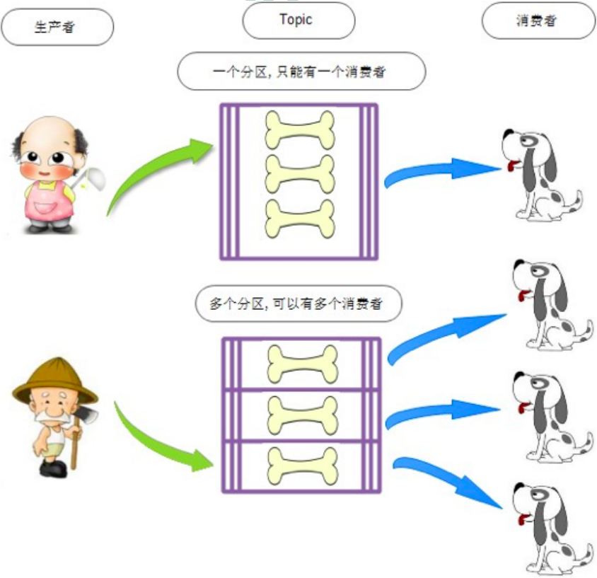
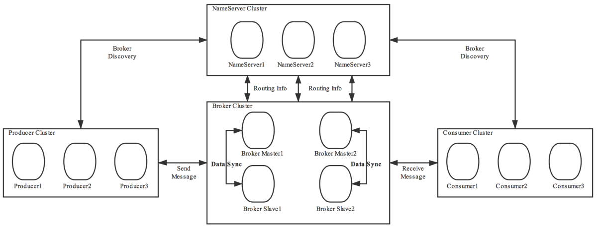

# 第2章 RocketMQ的安装与启动

## 一、基本概念

### 1、消息（Message）

消息是指，消息系统所传输信息的物理载体，生产和消费数据的最小单位，每条消息必须属于一个主题。

### 2、主题（Topic）

Topic表示一类消息的集合，每个主题包含若干条消息，每条消息只能属于一个主题，是RocketMQ进行消息订阅的基本单位。 topic:message 1:n message:topic 1:1

一个生产者可以同时发送多种Topic的消息；而一个消费者只对某种特定的Topic感兴趣，即只可以订阅和消费一种Topic的消息。 producer:topic 1:n consumer:topic 1:1

### 3、标签（tag）

​		为消息设置的标签，用于同一主题下区分不同类型的消息。来自同一业务单元的消息，可以根据不同业务目的在同一主题下设置不同标签。标签能够有效地保持代码的清晰度和连贯性，并优化RocketMQ提供的查询系统。消费者可以根据Tag实现对不同子主题的不同消费逻辑，实现更好的扩展性。

Topic是消息的一级分类，Tag是消息的二级分类。

Topic：货物

tag=上海

tag=江苏

tag=浙江

------- 消费者 -----

topic=货物 tag = 上海

topic=货物 tag = 上海|浙江

topic=货物 tag = *

### 4、队列（Queue）

存储消息的物理实体。一个Topic中可以包含多个Queue，每个Queue中存放的就是该Topic的消息。一个Topic的Queue也被称为一个Topic中消息的分区（Partition）。

一个Topic的Queue中的消息只能被一个消费者组中的一个消费者消费。一个Queue中的消息不允许同一个消费者组中的多个消费者同时消费。

在学习参考其它相关资料时，还会看到一个概念：分片（Sharding）。分片不同于分区。在RocketMQ中，分片指的是存放相应Topic的Broker。每个分片中会创建出相应数量的分区，即Queue，每个Queue的大小都是相同的。

### 5、消息标识（MessageId/key）

RocketMQ中每个消息拥有唯一的MessageId，且可以携带具有业务标识的Key，以方便对消息的查询。不过需要注意的是，MessageId有两个：在生产者send()消息时会自动生成一个MessageId（msgId)，当消息到达Broker后，Broker也会自动生成一个MessageId(offsetMsgId)。msgId、offsetMsgId与key都称为消息标识。

* msgId：由producer端生成，其生成规则为：

  producerIp + 进程pid + MessageClientIDSetter类的ClassLoader的hashCode +当前时间 + AutomicInteger自增计数器

* offsetMsgId：由broker端生成，其生成规则为：brokerIp + 物理分区的offset（Queue中的偏移量）

* key：由用户指定的业务相关的唯一标识

## 二、系统架构

RocketMQ架构上主要分为四部分构成：

